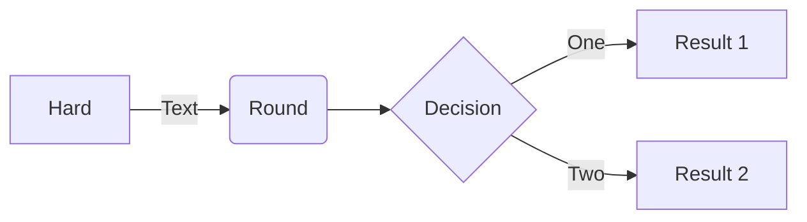
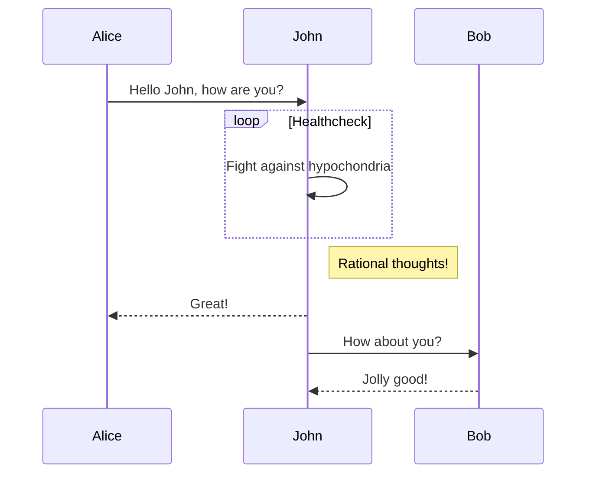
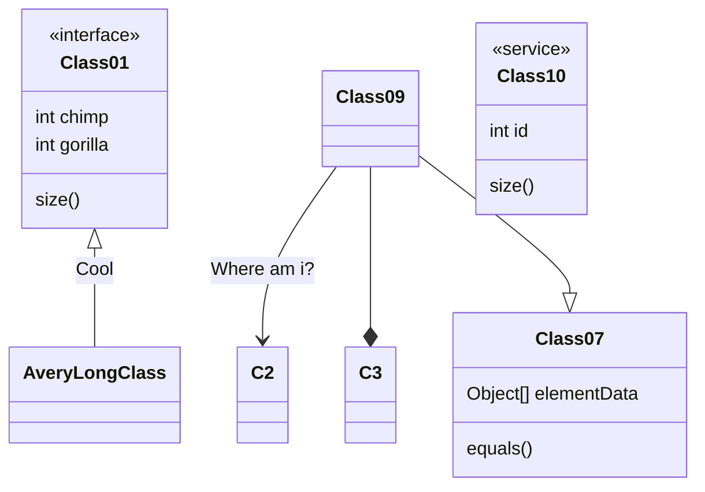
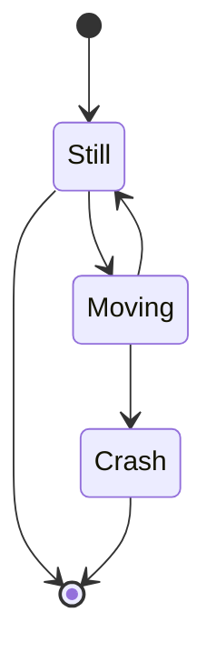
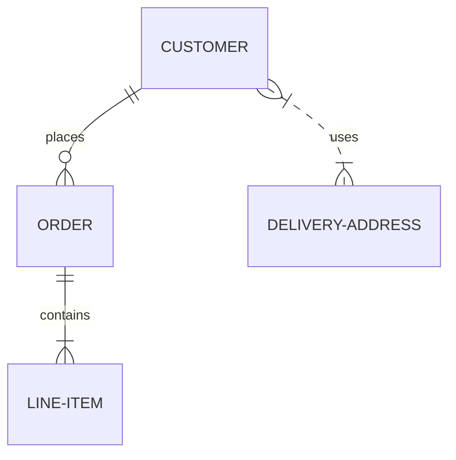
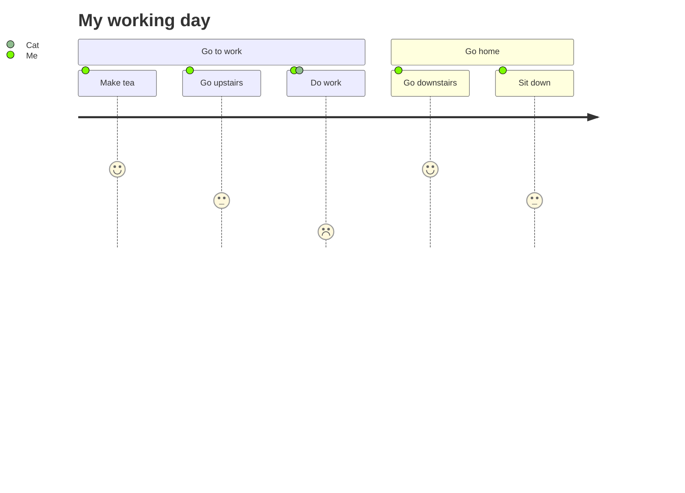
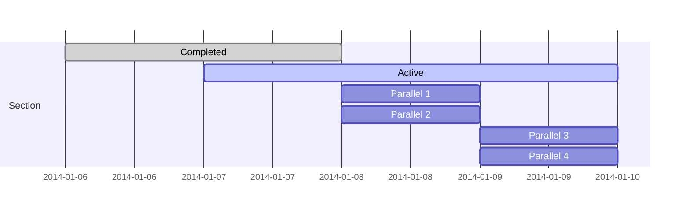
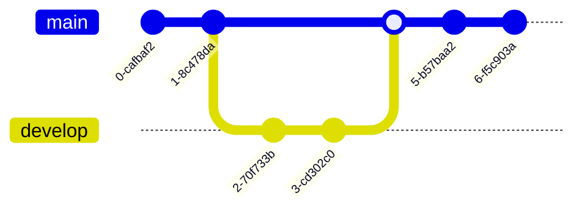

博客写作时的一些规范和特殊用法参考。

<!--more-->

------

# File

1. 使用文件名为链接名，因此使用英文，用 `-` 代替空格
1. Front Matter 中写上 `date` 和 `lastmod` 属性

# Markdown

[Markdown 语法参考](https://www.markdownguide.org/)

## 脚注

示例[^footnote]

[^footnote]: 这是一个脚注

## 标题引用 {#id0}

可以为标题增加 ID，以便在文内[引用](#id0)

## 告示

可以使用 引用 + emoji + 加粗 实现

> :memo: **Note:** Sunrises are beautiful.

> :bulb: **Tip:** Remember to appreciate the little things in life.

> :warning: **Warning:** Do not push the big red button.

## Mermaid Graph

<mark>需要 Markdown 支持</mark>

# Grammar

1. 推导数学公式时加入`:`，表示下面的公式与本段有关，除非有连接词
2. 中文使用直角引号「」
3. 中文和英文之间空格
4. 数字和单位之间空格，如 8 GB

# Math

## 基本知识

- 注释以 `%` 开头
- 颜色：${\color{red} a + b =} c$
- 分数如果分子分母只有一个符号则可以省去括号：$\frac 1 2$
- 盒装公式：$\boxed{a+b}$
- 对比 $|-k|, \lvert - k\rvert, |{-k}|$; $\lVert -k \rVert, \|-k\|$
- `\mod` 相关：$a\mod b$, $a\pmod b$, $a\bmod b$
- 数学推导：$\implies, \iff$
- 连分数使用 `cfrac`:
  $$
  \cfrac{1}{\sqrt{2}+ \cfrac{1}{\sqrt{2}+ \cfrac{1}{\sqrt{2}+\dotsb }}}
  $$
- 改变限制的位置使用 `\limits` 和 `\nolimits`:
  $$
  \begin{gather*}
  \sum_a \qquad \sum\nolimits_a \\
  \int_a \qquad \int\limits_a
  \end{gather*}
  $$
- 多行上下标使用 `\substack`:
  $$
  \sum_{\substack{
  0\le i\le m \\
  0 < j < n}}
  P(i,j)
  $$

- `\text` 表示 text，`\mathrm` 表示数学符号，`\operatorname` 表示函数

## Spacing

|            Code             |             Description              |
| :-------------------------: | :----------------------------------: |
|           `\quad`           | space equal to the current font size |
|            `\,`             |           3/18 of `\quad`            |
|            `\:`             |           4/18 of `\quad`            |
|            `\;`             |           5/18 of `\quad`            |
|            `\!`             |           -3/18 of `\quad`           |
| `\ `(space after backslash) |  equivalent of space in normal text  |
|          `\qquad`           |           twice of `\quad`           |

$$
\begin{align*}
f(x) &= x^2\! +3x\! +2 \\
f(x) &= x^2+3x+2 \\
f(x) &= x^2\, +3x\, +2 \\
f(x) &= x^2\: +3x\: +2 \\
f(x) &= x^2\; +3x\; +2 \\
f(x) &= x^2\ +3x\ +2 \\
f(x) &= x^2\quad +3x\quad +2 \\
f(x) &= x^2\qquad +3x\qquad +2
\end{align*}
$$

二元运算符和关系运算符的距离有极细微的差异：
$$
\begin{align*}
3ax+4by=5cz\\
3ax<4by+5cz
\end{align*}
$$
因此在定义自己的运算符时应确定是二元运算符 `\mathbin{\#}` 还是关系运算符 `\mathrel{\#}`

## 字体

默认拉丁字母、小写希腊字母是斜体，阿拉伯数字、大写希腊字母是罗马体

对字母有效：（一般用来表示特殊集合）

- `\mathbb`: 黑板粗体
- `\mathcal`: 手写体（无小写）
- `\mathscr`: 花体
- `\mathfrak`: 哥特体

$$
\begin{align*}
&RQSZ & &rqsz \\
&\mathbb{RQSZ} & &\mathbb{rqsz} \\
&\mathcal{RQSZ} & &\mathcal{rqsz} \\
&\mathscr{RQSZ} & &\mathscr{rqsz} \\
&\mathfrak{RQSZ} & &\mathfrak{rqsz}
\end{align*}
$$

对整个公式有效：`\mathnormal`, `\mathrm`, `\mathit`, `\mathbf`, `\mathsf`, `\mathtt`
$$
\begin{align*}
3x^2 \in R \subset Q \\
\mathnormal{3x^2 \in R \subset Q} \\
\mathrm{3x^2 \in R \subset Q} \\
\mathit{3x^2 \in R \subset Q} \\
\mathbf{3x^2 \in R \subset Q} \\
\mathsf{3x^2 \in R \subset Q} \\
\mathtt{3x^2 \in R \subset Q}
\end{align*}
$$

## Display Math

### 主环境

单行使用 `equation`:
$$
\begin{equation}
e^{\pi i} + 1 = 0
\end{equation}
$$
公式超出一行使用 `multline`:
$$
\begin{multline}
p = 1+2+3 \\
+4+5+6 \\
+7+8+9+10+11 \\
+12+13+14
\end{multline}
$$
多行居中不对齐使用 `gather`:
$$
\begin{gather}
2x - 5y =  8 \\
3x^2 + 9y =  3a + c
\end{gather}
$$
多行对齐使用 `align`:（每个等式由两部分组成，用 `&` 分隔；等式之间同样由 `&` 分隔。用于排列多个公式）
$$
\begin{align}
x&=y           &  w &=z              &  a&=b+c\\
2x&=-y         &  3w&=\frac{1}{2}z   &  a&=b\\
-4 + 5x&=2+y   &  w+2&=-1+w          &  ab&=cb
\end{align}
$$

`align` 会在列之间加入空格，如果希望自己控制距离则使用 `alignat`:
$$
\begin{alignat}{3}
& m   \quad && \text{módulo}            \quad && m>0\\
& a   \quad && \text{multiplicador}     \quad && 0<a<m\\
& c   \quad && \text{constante aditiva} \quad && 0\le c<m\\
& x_0 \quad && \text{valor inicial}     \quad && 0\le x_0 <m
\end{alignat}
$$
全长度 `align` 为 `flalign`:
$$
\begin{flalign}
x&=y           &  w &=z              &  a&=b+c\\
2x&=-y         &  3w&=\frac{1}{2}z   &  a&=b\\
-4 + 5x&=2+y   &  w+2&=-1+w          &  ab&=cb
\end{flalign}
$$

**主环境都可以在名字最后加入 `*` 来抑制自动编号**

### 从属环境

公式多行推导使用从属环境 `split`:
$$
\begin{equation}
\begin{split}
\cos 2x &= \cos^2 x - \sin^2 x \\
&= 2\cos^2 x - 1
\end{split}
\end{equation}
$$
分段函数使用 `cases`（公式样式会变为行内公式）或 `dcases` (需要 `mathtools` 包)
$$
\require{mathtools}
\begin{gather*}
f(x) = \begin{cases}
\frac{x+1}{4}, & \text{if } 0 < x < 1; \\
\max_{x} g(x), & \text{otherwise}.
\end{cases} \\
f(x) = \begin{dcases}
\frac{x+1}{4}, & \text{if } 0 < x < 1; \\
\max_{x} g(x), & \text{otherwise}.
\end{dcases}
\end{gather*}
$$
其它从属环境：`multlined`, `gathered`, `aligned`, `alignedat`

### 其它

MathJax 尚不支持从属编号环境 `subequations`

## 自定义

### 宏<mark>TODO</mark>

$$
\def\specialFrac#1#2{\frac{x + #1}{y + #2}}
\specialFrac{7}{z+3}
$$

$$
\DeclarePairedDelimiters\norm{\lVert}{\rVert} % require{\mathtools}
\norm{v}_2 \quad \norm{\frac 1 2} \quad \norm*{\frac 1 2} \quad \norm[\Bigg]{v}
$$

### 自定义数学符号

数学符号以罗马体表示，间距和上下标也会有区别，比如正确的写法 $\sin(x)$ 对比 $sin(x)$。自定义数学符号可以使用 `\DeclareMathOperator` 或 `\DeclareMathOperator*`。等价于使用 `\operatorname` 和 `\operatorname*`
$$
\DeclareMathOperator*{\argmin}{arg\,min\,}
\DeclareMathOperator{\argmax}{arg\,max\,}
\begin{gather}
\argmin_x \\
\argmax_x \\
\operatorname{rank}{x}
\end{gather}
$$

## MathJax Extensions

See [MathJax Extension List](https://docs.mathjax.org/en/latest/input/tex/extensions/index.html) <mark>TODO</mark>
$$
\toggle{math1}{math2}\endtoggle
$$

physics:
$$
\require{physics}
$$
centernot:
$$
\require{centernot}
\centernot\implies \qquad \not\implies
$$

mathtools:

## 自定规范

下面是一些自己制定的规范，用来更好的统一自己的写作，非强制

1. Expectation: $\mathbb{E}$
2. Set: $\mathbb{R}, \mathbb{Z}$
3. Empty set: $\varnothing$
4. Gaussian: $\mathcal{N}$
5. Conditional probability: $p(a | b)$
6. Set with conditions: $\{a \mid a\in A\}$
7. $i$-th
